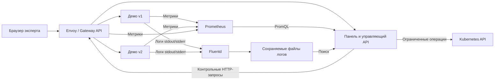

# TrafficOps: предложение архитектуры

Статус: архитектура согласована пользователем 30 сентября 2026 ответом «все ок». Реализация не начата; совместимость образов и работа на VM должны быть подтверждены во время реализации.

## Задача и пользовательский сценарий

Эксперт разворачивает стенд из публичного репозитория на Ubuntu 24.04, открывает TrafficOps и последовательно проверяет маршрутизацию, выпуск новой версии, метрики, собранные логи и восстановление. Цель — продемонстрировать обязательные технологии и дополнительные функции в одном воспроизводимом сценарии.

В панели предлагаются пять разделов: обзор, трафик, релизы, инциденты, диагностика. Эксперт запускает ограниченную серию HTTP-запросов, направляет часть трафика на новую версию, включает тестовые ошибки и видит автоматический возврат трафика на стабильную версию. У каждой серии запросов есть маркер для поиска в логах; у каждой управляющей операции — запись о начале, результате и причине.

## Состав

| Компонент | Предложение | Назначение |
| --- | --- | --- |
| ОС | Ubuntu 24.04 | Обязательная среда для фактической проверки развёртывания |
| Kubernetes | Один узел, kubeadm, containerd, Flannel | Кластер в VM и сеть pod |
| Gateway API | Envoy Gateway | HTTPRoute, несколько путей и взвешенное распределение запросов между версиями |
| Панель | HTML, CSS и JavaScript, статические файлы | Светлый интерфейс, графики, команды и результаты |
| Управляющий API | Python / FastAPI, один экземпляр | Чтение данных, разрешённые действия, генератор трафика и контроль релиза |
| Демонстрационный сервис | Маленькое HTTP-приложение, два Deployment `v1` и `v2` | Различимые ответы, контролируемые ошибки и метрики каждой версии |
| Метрики | Prometheus | Сервис, Gateway и состояние инфраструктуры |
| Логи | Fluentd → файлы на сохраняемом томе | Сбор логов приложения, поиск через управляющий API |
| Состояние операций | SQLite на сохраняемом томе | Журнал и состояние релиза после перезапуска API |
| Автоматизация | shell, Makefile, Kubernetes manifests; Helm для установки контроллера | Подготовка, развёртывание, повторный запуск и проверки |
| CI | GitHub Actions | Проверка конфигураций, кода и сборки образов |

Собственное приложение небольшое: оно нужно для управляемых ошибок и различимых версий. В оценке не заявлять его как самостоятельное преимущество. Использовать общую базу кода для двух версий, а различия задавать конфигурацией.

Версии компонентов фиксировать в репозитории перед первым развёртыванием. Базовый кандидат: Kubernetes 1.36 и совместимая стабильная ветка Envoy Gateway 1.9; точные patch-версии и digest образов выбирать по опубликованным совместимым выпускам. ARM64-манифест каждого выбранного образа проверить до установки. Это ещё не подтверждение запуска на VM.

## Связи и границы управления

Генератор трафика обращается через Gateway. Внутренний прямой запрос к Service не считается проверкой GW-004. Панель показывает фактические метрики Prometheus и записи после Fluentd; нельзя заменять их собственными счётчиками интерфейса или прямым чтением логов pod.

Управляющий API выполняет только заранее определённые операции с ресурсами демонстрационного namespace: изменение весов конкретного HTTPRoute, включение тестовых ошибок новой версии, изменение допустимого числа реплик и удаление одного демонстрационного pod для проверки восстановления. RBAC ограничивается требуемыми ресурсами; `cluster-admin` приложению не выдаётся. Имена ресурсов задаёт сервер, клиент не передаёт произвольные команды или манифесты.

Панель доступна эксперту через Gateway в локальной среде VM. Управляющие действия защищаются сессионной авторизацией; секрет создаётся при установке и передаётся безопасным способом вне Git. Cookie — HttpOnly/SameSite; изменяющие запросы проверяют Origin и CSRF-токен. Prometheus и Kubernetes API не публикуются через панель как произвольные прокси.

## Поведение

- Обзор показывает готовность компонентов, распределение трафика, число запросов, долю ошибок и задержку. Для каждого источника видны время обновления и состояние недоступности.
- Трафик запускается конечной серией с ограничением частоты, длительности и количества запросов. Серии можно остановить; произвольные внешние URL не принимаются.
- Релизы позволяют начать canary с 10% трафика, вручную изменить долю и завершить либо откатить выпуск. Фактическое переключение проверяется HTTP-запросами и статусом Gateway API.
- Инциденты позволяют включить контролируемые HTTP 500 на `v2` и отдельно удалить один pod приложения. Подтверждение восстановления включает готовность ресурсов и успешный запрос через Gateway.
- Диагностика показывает данные Prometheus и отфильтрованные собранные логи. Request ID хранить в логах; не использовать уникальный ID каждого запроса как label метрики.

## Автоматический откат

API сравнивает показатели новой версии со следующими значениями по умолчанию: окно 60 секунд, минимум 30 запросов, доля HTTP 5xx больше 5%, проверка каждые 10 секунд. Превышение должно наблюдаться две проверки подряд. Все значения настраиваемы и документируются.

До оценки дождаться заполнения окна после начала текущего canary, чтобы не принимать решение по данным предыдущего релиза. Использовать свежие метрики фактических запросов `v2`. Если данных недостаточно или Prometheus недоступен, приостановить продвижение и показать причину; не выдавать отсутствие данных за отсутствие ошибок.

При срабатывании вернуть веса маршрута к `v1`, проверить принятый маршрут и успешные запросы. Записать использованные показатели, причину и результат. Не удалять новую версию. Ошибка переключения отображается как ошибка, а не как успешное восстановление. Сценарий не перезапускает canary сам; новый запуск — действие эксперта. Ручной откат доступен независимо от наличия метрик.

Состояние релиза хранить в SQLite; после перезапуска API сверять его с фактическим HTTPRoute. Принимать одну изменяющую операцию за раз, чтобы canary, ручной и автоматический откат не перезаписывали друг друга.

## Логи, хранение и ресурсы

Fluentd собирает access/error-логи демонстрационных контейнеров и пишет в сохраняемую точку назначения. Для демонстрации настроить частую выгрузку буфера, а не полагаться на стандартную ежедневную запись `out_file`. Поиск панели читает только ограниченные файлы назначения, поддерживает фильтр маркера и лимит выдачи.

Задать ограничение размера и срока хранения логов, метрик и журнала операций. SQLite и журналы управляющих действий сохраняются при перезапуске; потерю данных при удалении VM явно указать как ограничение single-node стенда.

Проверенная конфигурация VM — ARM64 и 4 ГБ RAM; объём диска 40 ГБ сообщён пользователем. Достаточность ресурсов всему составу пока не доказана. Предлагается один экземпляр Prometheus и контроллера, небольшой временной горизонт хранения и умеренный тестовый трафик. Фактические requests/limits определить по замерам. Если состав не помещается, показать замер и обсудить ресурсы либо упрощение.

## Порядок реализации и проверки

1. Обязательная база: Ubuntu 24.04, kubeadm, приложение и запрос через Gateway. Проверяет оркестратор.
2. Prometheus и Fluentd: реальные метрики и запись запроса в точке назначения. Проверяет оркестратор.
3. Панель, операции релиза, автоматический откат и демонстрационные инциденты. Проверяет оркестратор.
4. CI, чистое и повторное развёртывание, инструкция для пользователя, публичный репозиторий и паспорт. Финальная интеграционная проверка оркестратором.

Исполнители — GPT-6 Luna high; оркестратор — GPT-6.1 Sol medium. Отдельные ревьюеры для мелких изменений не запускаются.

В начале реализации оставить один целевой runnable check для логики решения об откате: нормальные показатели, превышение порога, недостаточная выборка и устаревшие данные. Интеграционные проверки должны подтвердить маршрутизацию, метрики, логи, фактический откат и восстановление состояния после перезапуска. Все фактические доказательства привязать к ID в `docs/requirements/06-acceptance.md`; до запуска статусы остаются «не проверено».

Инструкция для пользователя содержит последовательность подготовки VM и команд, ожидаемые результаты, проверку повторного запуска, проход сценария панели и восстановление исходного состояния. CI-проверки не заменяют подтверждение Ubuntu 24.04 на VM.

## Источники для выбора компонентов

- [Kubeadm: требования к среде](https://kubernetes.io/docs/setup/production-environment/tools/kubeadm/install-kubeadm/): минимум 2 CPU для control plane и 2 ГБ RAM; это минимум кластера, не оценка всего стенда.
- [Envoy Gateway: совместимость версий](https://gateway.envoyproxy.io/news/releases/matrix/).
- [Envoy Gateway: метрики proxy для Prometheus](https://gateway.envoyproxy.io/docs/tasks/observability/proxy-metric/).
- [Fluentd: официальные ARM64-образы](https://github.com/fluent/fluentd-docker-image).
- [Fluentd: вывод в файлы и буферизация](https://docs.fluentd.org/output/file).
- [Flannel: установка и архитектуры](https://github.com/flannel-io/flannel).
